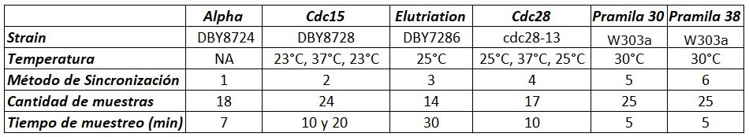

Redes de Regulación Genética:   
~ Forma en la que un conjunto de genes modulan la actividad de otros genes con la finalidad de llevar a cabo un proceso biológico 

Mapa Auto-organizado:  
~ Red Neuronal artificial cuya principal característica es que, además de formar agrupaciones, las organiza de manera que las más similares se ubiquen en neuronas cercanas y las más disimilares se ubiquen en neuronas lejanas dentro de su mapa de salida  

# Resumen
Con la secuenciación de genomas completos de un gran número de organismos y la
identicación de los genes contenidos en ellos, el descubrimiento de los mecanismos que
regulan la expresión genética ha recibido una creciente atención y se ha convertido
en uno de los principales tópicos en el área de la bioinformática. Desgraciadamente,
los sistemas de regulación genética tienden a ser muy complejos y frecuentemente la
información con la que se cuenta es muy poca.

&nbsp;

En la presente tesis, además de la propuesta mencionada con anterioridad, se propone
el uso de una técnica de reconocimiento de patrones, una red neuronal artificial
no supervisada llamada **_Mapa Auto-organizado_** (SOM, por sus siglas en inglés) la cual
ha sido aplicada con éxito en procesos que contienen señales ruidosas, clasificándolas
y organizándolas. Como un banco de pruebas para el uso de SOM en la búsqueda de
posibles relaciones entre genes y su posible contribución en algunos procesos biológicos,
se seleccionaron 282 genes de Saccharomyces cerevisiae que han demostrado tener una
actividad durante el ciclo celular a través de experimentos biológicos. El nivel de expresi
ón de estos genes se analizó en cinco de las bases de datos de series de tiempo de
microarreglos de ADN mas citadas que se han utilizado en el estudio del ciclo celular
de este organismo. El análisis presentado fue útil para descubrir posibles relaciones
entre los genes usando relativamente pocas muestras, basándose en su comportamiento
consistente a través del tiempo en las cinco bases de datos del ciclo celular de S. cerevisiae,
sin tener conocimiento previo acerca de sus características, tales como su función biológica o sus sitios de ligaduras.

# Objetivos

## Motivación

La principal motivación de este trabajo de investigación ha sido el deseo
de contribuir al modelado de las relaciones reguladoras entre genes, lo que podría
ayudar en el desarrollo de tratamientos preventivos y personalizados para el trastorno genético
enfermedades.

## Objetivo General

Este trabajo de investigación tiene el objetivo de desarrollar metodologías basadas en técnicas de 
inteligencia computacional, que podrían ser útiles para enla búsqueda de posibles relaciones entre genes 
implicados en diversos procesos biológicos.

## Objetivos Particulares

1. Desarrollar un modelo que ayude en la investigación de la función reguladora de los genes, 
utilizando datos de microarrays de expresión, incluso en ausencia de información completa sobre
el problema.

2. Descubrir patrones regulatorios entre genes basados en la consistencia de sus
comportamiento, a través de la comparación de diferentes bases de datos de microarrays que contienen
niveles de expresión genética.

# Artículos Publicados 

Los siguientes artículos se derivaron de este trabajo: 

R. Chavez-Alvarez, A. Chavoya, and C. Lopez-Martin. Finding the minimal gene
regulatory function in the presence of undefined transitional states using a genetic
algorithm. In Information Processing in Cells and Tissues, pages 238-249. Springer,
2012. Presented in the 9th International Conference on Information Processing in Cells
and Tissues, held from March 31 to April 2, 2012 at Trinity College, Cambridge, UK
[@chavez2012finding].

&nbsp;

R. Chavez-Alvarez, A. Chavoya, and A. Mendez-Vazquez. Discovery of possible
gene relationships through the application of self-organizing maps to DNA microarray
databases. PLOS ONE, 9(4):e93233, 2014. [@chavez2014discovery].

# 1 Introducción

Uno de los avances biomédicos más importantes del siglo pasado fue el descubrimiento
de la molécula de ADN (ácido desoxirribonucleico). Esta molécula transmite la genética
información de una celda a otra durante la replicación [@watson1953molecular; @bumgarner2013overview], y está organizada
en estructuras celulares llamadas cromosomas, que pueden contener cientos de miles
de genes. El ADN es responsable de las características físicas de los individuos, que son
transmitido de padres a hijos siguiendo ciertas reglas [@saghai1984ribosomal; @alberghina2012cell].

## 1.1 Redes de Regulación Genética

La comprensión de los mecanismos moleculares que controlan la regulación genética.
Las redes pueden ser útiles para descubrir qué sucede cuando algo sale mal en
enfermedades. Si somos capaces de descubrir la forma en que funcionan estas redes reguladoras
condiciones normales y de enfermedad, entonces podría ser posible detectar un trastorno genético
enfermedades incluso antes de que comiencen a afectar la salud de las personas. Además, podría ser
posible acelerar su curación con un tratamiento personalizado. Estos son algunos de
las razones por las que miles de científicos y cientos de instituciones han estado invirtiendo
ingentes cantidades de dinero para estudiar la regulación genética durante varias décadas.

## 1.3 Redes de Regulación Transcripcional

El primer paso de la transcripción consiste en la separación de las cadenas de ADN donde el
Se localiza el gen a transcribir. Posteriormente, la secuencia de nucleótidos contenida en
una de las dos hebras es leída por la ARN polimerasa II para formar una sola hebra de ARN,
como el ARN mensajero o el ARN ribosómico, entre otros [@chargaff1960nucleic] 

# 2 Aplicacion de una Red Neuronal No Supervisada a Bases de Datos de Microarreglos de ADN

Las técnicas de reconocimiento de patrones pueden contribuir al análisis de
mediciones tan masivas, proporcionando un modelo de evolución del nivel de expresión génica. En
mi segunda propuesta de extracción de conocimiento a partir de datos de microarrays, presento el uso de
una de estas técnicas: Mapas Autoorganizados (SOM). SOM es un tipo de sin supervisión
red neuronal artificial desarrollada por Teuvo Kohonen [@kohonen1982self]. Se inspira en la idea
de cómo nuestro cerebro procesa diferentes tipos de datos. La corteza cerebral está organizada en
áreas separadas según la tarea a realizar (ver Fig. 2). Esto significa que
para el mismo tipo de estímulo o datos de entrada, la misma área del cerebro se activa en tal
una forma en que diferentes señales activan consistentemente diferentes partes del cerebro. Similar,
Los SOM tienen la capacidad de activar áreas similares en el mapa de salida para entradas similares
datos y diferentes áreas para diferentes datos de entrada.

## 2.1 Condiciones Experimentales y Cepas utilizadas en las Bases de Datos Analizadas

Cinco bases de datos que contienen información sobre los niveles de expresión de Saccharomyces cerevisiae
a lo largo de dos ciclos celulares se analizaron con el algoritmo SOM. Elegimos estas
bases de datos como banco de pruebas para el método propuesto, ya que todos ellos han sido ampliamente utilizados
a lo largo de los años por diferentes autores. Estas bases de datos se obtuvieron bajo diferentes
condiciones (ver Tabla 1). Para todas las bases de datos, cada experimento comienza con
poblaciones de células que se han sincronizado utilizando diferentes métodos que detienen la
células en fase M / G1. Las bases de datos alpha y cdc15 fueron obtenidas por Spellman y
Alabama utilizando plataformas de microarrays de ADN / ADNc manchado no comerciales identificadas como GPL59 y GPL62 en la base de datos de Gene Expression Omnibus en el Centro Nacional ^[La base de datos GEO es el depósito más grande de experimentos basados en microarrays que miden la abundancia de ARNm, ADN genómico y moléculas de proteínas, así como muestras e información sobre las plataformas utilizadas, incluidas las tecnologías no basadas en arreglos.]

## 2.2 Mapas Auto-Organizados
Los mapas autoorganizados están estrechamente relacionados con la técnica de k-medias, ya que también obtiene
centros de clúster, pero con la ventaja de que la información está organizada espacialmente en
una rejilla de salida unidimensional, bidimensional o tridimensional, cilindro o toroidal. 
Las neuronas de la cuadrícula pueden tener una forma lineal, rectangular o hexagonal.
La forma más utilizada es la cuadrícula hexagonal bidimensional.

Las unidades en el mapa de salida tienen un peso, asignado inicialmente al azar o
mediante el uso de los vectores propios correspondientes a los dos componentes principales más grandes
de todos los vectores de entrada [@kohonen1982self]. En el presente trabajo, los pesos iniciales se asignaron utilizando
el último método.

&nbsp;

El propósito de la inicialización utilizando el método de componentes principales es asignar
pesos a las unidades en el mapa de salida que son lo más similares posible a los valores en
los datos de entrada. Los pasos del algoritmo son: 

**_1. Proceso Competitivo_**

$$
min \Arrowvert \vec{x} - \vec{w_j}\Arrowvert,
$$

En donde $\vec{x}$ es el vector de entrada y $\vec{w_j}$ es el vector de los pesos para la $j$-th neurona en el mapa de salida. 

El vector de entrada, el cual contiene la serie de tiempos de los niveles de expresión genética de cada gen, es comparado con todas las neuronas del mapa de salida con la finalidad de encontrar la neurona cuyos valores tengan la máxima similitud con los del gen que se está analizando. 

**_2. Proceso Cooperativo_**

                                                               					
$$
h_{(j,i)}= exp \left ( - \frac{{d^2_{j,i}}}{2 \sigma ^2} \right ),
$$		

**_3. Proceso de Adaptación Sináptica_**

$$
\eta(t) = \eta_0 \left (1 - \frac{t}{T} \right ),
$$

$$
\eta(t) = \frac{\eta_0} {(b - t-1 )},
$$

**_4. Ajuste del peso de las Unidades_**

$$
\vec{w_j} (t+1) = \vec{w_j} (t) + \eta(t) h_{j,i}(t)(\vec{x} - \vec{w_j})
$$

# 3 Resultados y Discusión

En este capítulo, los resultados de la comparación de la agrupación de genes realizada en las cinco bases de datos de expresión génica de S. cerevisiae durante el proceso del ciclo celular. En general, esta comparación se puede hacer visualmente o mediante el cálculo de la distancia entre las neuronas donde los genes están agrupados por el algoritmo SOM en las diferentes bases de datos. Genes con un comportamiento constante durabte el ciclo celular podría tener una correlación positiva entre ellos, mientras que aquellos que son consistentemente lejos unos de otros, podrían tener una correlación negativa. Un análisis del comportamiento de los genes. También se presenta la coherencia en las cinco bases de datos con el objetivo de descubrir genes que puede haber sido afectado por las condiciones bajo las cuales se realizaron diferentes experimentos llevado a cabo.

Como se mencionó en el Capítulo anterior, un mapa de salida de 400 unidades (20 filas por 20 columnas)
fue creado para cada base de datos, basado en la mejor agrupación de niveles de expresión génica
obtenido de la base de datos alfa proporcionada por Spellman et al. [@spellman1998comprehensive]. Como una ilustracion
de la agrupación obtenida, la Fig. 4 presenta el mapa de salida para los genes del alpha30
base de datos. 

Los genes con niveles de expresión muy similares a lo largo de todos los puntos de tiempo tendían a ser
asignado a la misma neurona; Además, cuanto más cercanas estaban las neuronas, más similares eran las
los niveles de expresión estaban en los grupos de genes asignados a ellos. Por el contrario, los grupos de genes
con diferente comportamiento se ubicaron más lejos en el mapa. 

# 4. Conclusiones

Aplicamos la técnica de SOM a cinco de las bases de datos de microarrays más estudiadas
de Saccharomyces cerevisiae. A través de esta herramienta fue posible descubrir posibles
relaciones entre genes, basadas en su comportamiento a lo largo del tiempo en todas las bases de datos,
sin ningún conocimiento previo sobre sus características, como funciones biológicas
durante el ciclo celular o sus sitios de unión para realizar el análisis.Además fué posible encontrar genes que se comportan de manera similar en todas las bases de datos y otras que
se comportaron de manera diferente en solo una de las bases de datos, lo que sugiere que podrían
afectado por las condiciones experimentales o la cepa de levadura utilizada. 

También mostramos la utilidad de la visualización de los niveles de expresión a través de mapas codificados por colores para
analizar la evolución de los niveles de expresión génica durante el ciclo celular. 

![**Mapa de Salida de la Red Neuronal conteniendo la Distribución de los genes**. Los genes se mapean de acuerdo con su similitud en el nivel de expresión. Los clusters de genes con niveles de expresión similares en la serie temporal se asignan a áreas que se encuentran más cerca el uno del otro. Los clústeres que están más cerca en el mapa tienen niveles de expresión más similares. Los genes con diferente comportamiento se encuentran más lejos en el mapa. Además, los genes con comportamiento opuesto tienden a ubicarse en neuronas opuestas en el mapa.](fig2.jpg)

# Referencias
